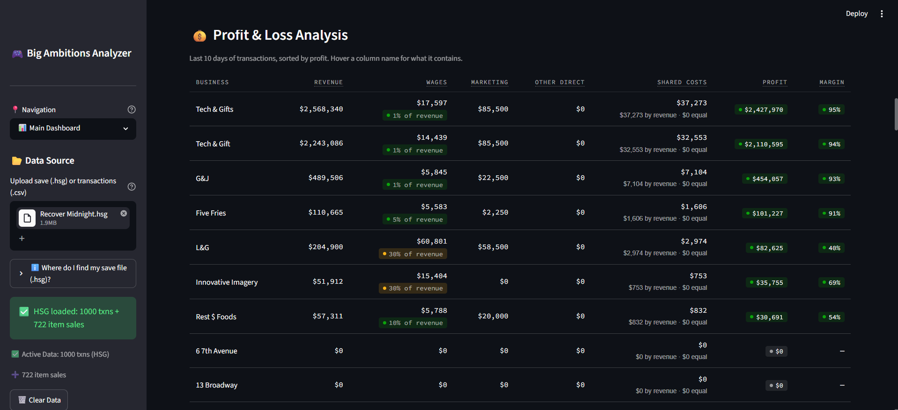
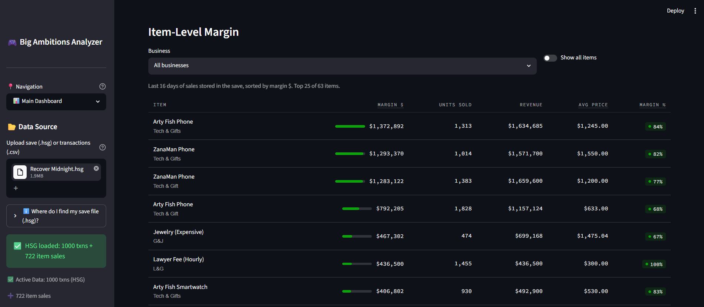
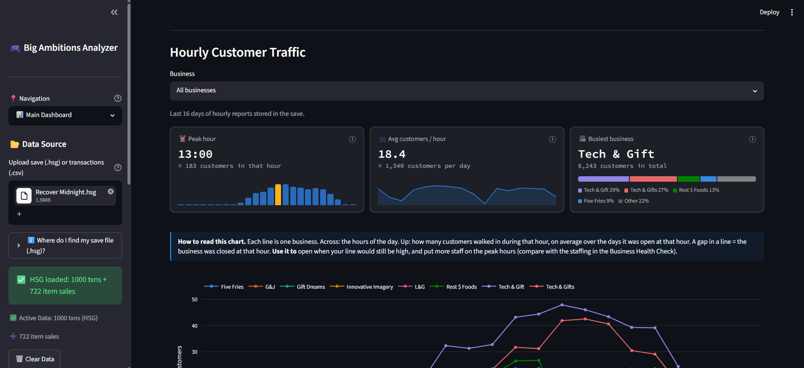
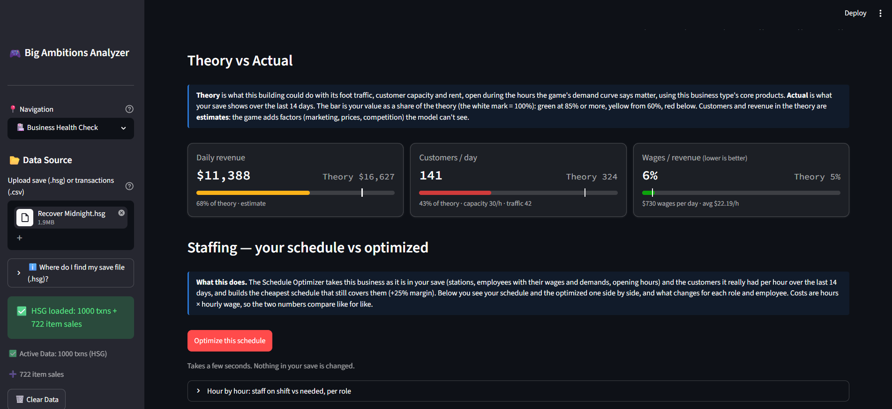
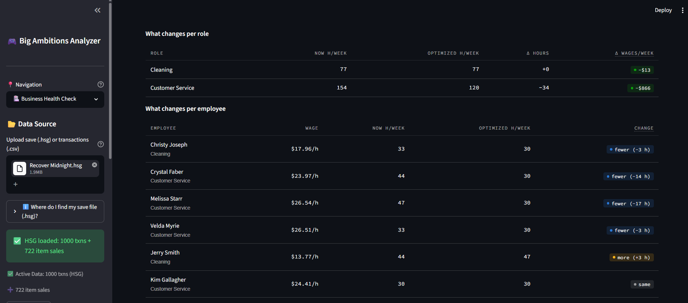
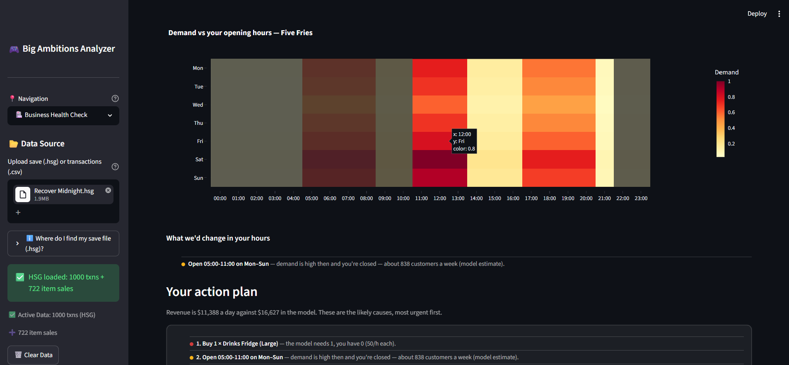

# Big Ambitions Business Analyzer 📊

A free web app that reads your [Big Ambitions](https://store.steampowered.com/app/1331550/Big_Ambitions/) save file and tells you how each of your businesses is doing, what to fix first, and how to staff it for less.

[](https://big-ambitions-analyzer1-0.onrender.com/)
[](https://www.python.org/)
[](https://streamlit.io/)

**[🚀 Try it Live](https://big-ambitions-analyzer1-0.onrender.com/)** | **[📸 Screenshots](#-screenshots)** | **[✨ Features](#-features)**

---

## Overview

Load a `.hsg` save and the analyzer reads your businesses, employees, schedules, furniture, sales per item and customers per hour. It turns them into:

- **alerts** grouped by urgency (critical, warning, info),
- a **dashboard** with revenue, profit & loss, item margins and hourly traffic,
- a **Health Check** per business: your numbers against what the building could do, a written action plan, and your schedule next to an optimized one,
- a **Schedule Optimizer** (linear programming) that builds the cheapest schedule covering your real customers.

The save is only read, in your session: nothing is changed or stored. The old transactions export (CSV / XLSM) still works for the dashboard and P&L.

**Received positive feedback from the game's founder** and used by the Big Ambitions community.

---

## ✨ Features

### 📊 Main Dashboard
- **Business alerts**: empty buildings, losing money, employees about to quit, overstaffed hours, import paused, missing customer demands and more
- **Overview**: transactions, days covered, transaction mix, balance trend
- **Revenue per business**: total, change vs the previous week, share of total, daily trend chart
- **Profit & Loss** per business, with every cost column explained and colour thresholds
- **Item-level margin**: margin, units, revenue and price of every item you sell
- **Hourly customer traffic**: peak hour, customers per hour, busiest business or weekday

### 🏥 Business Health Check
- **Your businesses**: one card per business with its problems and its customer demands (✓ met / ✕ missing)
- **Theory vs actual**: revenue, customers and wage share against a model of the same building (traffic, capacity, rent, the game's demand curve)
- **What to fix first**: every check below the model, from furniture to opening hours to staff per role
- **Staffing**: your schedule from the save next to the optimizer's, with the changes per role and per employee and a day-by-day grid
- **Opening hours advice** and an **action plan** with the most useful things to do
- **Plan a new business**: best products, best zones, break-even, the furniture and staff the model needs

### 🗓️ Schedule Optimizer
- **Load from your save**: stations, employees with wages and demands, opening hours, real customers per hour
- Or set up any business by hand, no file needed
- Respects employee demands (full/part-time, days off, free weekends, no mornings…) as critical or important
- Never staffs more people than the stations allow; covers the customers of every hour
- Game-style schedule grid, cost comparison and plain-language recommendations

### 📈 Forecasting · 🎮 Game Data Explorer
- Revenue and profit trends with a simple forecast and marketing impact
- Products, business types, prices and buildings from the game data

---

## 🚀 Quick Start

### Using the web app

1. Open the **[live app](https://big-ambitions-analyzer1-0.onrender.com/)**
2. Find your save: on Windows it is in
   `%USERPROFILE%\AppData\LocalLow\Hovgaard Games\Big Ambitions\SaveGames\Big Ambitions\<random folder>\`
   (older builds: `EA 0.10`, `EA 0.11`). Use your own save or the game's automatic ones (`Recover #0/#1/#2.hsg`, `Recover Midnight.hsg`), the most recent.
3. Upload the `.hsg` file in the sidebar
4. Start from the dashboard, then open the **Business Health Check**

No save at hand? Click **Test it (Demo Data)** in the sidebar.

> Using a transactions export (CSV / XLSM) instead? Set the game language to **English** before exporting: the file loads in any language, but the P&L categorizes transactions by their English names.

*Free hosting may take ~30 seconds to wake up after inactivity. Refresh if it seems stuck.*

### Running locally
```bash
git clone https://github.com/raytp29-hub/big-ambitions-analyzer1.0
cd big-ambitions-analyzer1.0
pip install -r requirements.txt
streamlit run app.py
```

---

## 📸 Screenshots

### Main Dashboard

**Business alerts**

*The first thing you see after loading a save: problems grouped by urgency, with a button to the Health Check.*

**Overview**

*Transactions, days covered, transaction mix and balance, each with its own small chart.*

**Revenue per business**

*Total revenue, change vs the previous 7 days, share of the total and daily trend for every business, plus a chart with all of them.*

**Profit & Loss**

*Revenue, wages (with their share of revenue), marketing, shared costs, profit and margin per business. Hover a column name for what it contains.*

**Item-level margin**

*Every item you sell, ranked by margin, with units, revenue and average price.*

**Hourly customer traffic**

*When your customers arrive: peak hour, customers per hour and the busiest business, with a note on how to read the chart.*

### Business Health Check

**Your businesses**

*One card per business: its most urgent problem on the edge, the issues inside and the customer demands at the bottom.*

**Your business, from the save**

*Type, location, traffic, capacity and rent read from the save, customer demands and satisfaction.*

**Theory vs actual and staffing**

*Revenue, customers and wage share against the model of the same building; one click runs the optimizer on this business.*

**Your schedule vs optimized**

*The same day, your shifts from the save above and the optimized ones below.*

**What changes**

*Hours and wages per role and per employee, now and after the optimization.*

**What to fix first**

*Every check below the model, worst first, with what the model expects and what you have.*

**Opening hours and action plan**

*Demand vs your opening hours, written advice on when to open or close, and the action plan for this business.*

### Schedule Optimizer

**Load a business from your save**

*Pick a business: stations, employees, demands and hours are filled in from the save.*

**Optimized weekly schedule**

*A game-style grid: who works which station and which hours, day by day.*

**Recommendations**

*Plain-language advice on unmet requests, understaffed roles and where hiring or trimming hours would help.*

---

## 🛠️ Tech Stack

- **Python 3.11+**, **Streamlit** (UI), **Pandas** (data), **Plotly** (charts)
- **PuLP** + CBC for the schedule optimization (linear programming)
- Game data extracted with AssetRipper; save files read with a vendored parser (see Credits)
- Deployed on **Render**

---

## 📊 How It Works

### Reading the save
The `.hsg` save is parsed into tables: businesses, employees, shifts, opening hours, furniture, customer demands, sales per item per day and customers per hour (about the last 16 days), and the transaction ledger (the game keeps the last 1,000 transactions).

### Theory vs actual
For each business the model builds the same building in theory: furniture to reach its capacity, open in the hours where the game's demand curve reaches 0.3 (day by day), staffed hour by hour (cash registers for the customers of each hour, cleaning and security one per open hour). Your save is compared with it over the last 14 days. Customers and revenue in the theory are estimates.

### Schedule optimization
A linear program assigns each employee one contiguous shift per day:
- **Objective:** lowest wage cost, then highest employee satisfaction
- **Constraints:** customers of every hour covered (+25% margin), never more people than stations, weekly hour limits for full/part-time, employee demands (days off, free weekends, no mornings…)

---

## 🙏 Credits

- Save file parsing is based on **[big-copilot](https://github.com/PeterHartwieg/big-copilot)** by **Peter Hartwieg** (MIT License). The parser (`core/hsg_reader.py`) is vendored unchanged with its license notice. His project and in-game mod are worth a look too.
- Big Ambitions is developed by Hovgaard Games. This is an unofficial fan tool.

---

## 🤝 Contributing

This is a personal portfolio project, but feedback and suggestions are welcome!

- Found a bug? [Open an issue](https://github.com/raytp29-hub/big-ambitions-analyzer1.0/issues)
- Have a feature idea? [Start a discussion](https://github.com/raytp29-hub/big-ambitions-analyzer1.0/issues/new)
- Want to contribute? [Submit a PR](https://github.com/raytp29-hub/big-ambitions-analyzer1.0/pulls)

---

## 📝 License

MIT License - feel free to use this for your own projects!
