# Big Ambitions Business Analyzer 📊

A free web application for analyzing business performance and optimizing employee schedules in [Big Ambitions](https://store.steampowered.com/app/1331550/Big_Ambitions/).

[](https://big-ambitions-analyzer1-0.onrender.com/)
[](https://www.python.org/)
[](https://streamlit.io/)

**[🚀 Try it Live](https://big-ambitions-analyzer1-0.onrender.com/)** | **[📸 Screenshots](#screenshots)** | **[🎯 Features](#features)**

---

## Overview

Built to solve the challenge of manually tracking profits and optimizing employee schedules in Big Ambitions. This tool automates business analysis and generates optimal employee schedules using mathematical optimization.

**Received positive feedback from the game's founder** and actively used by the Big Ambitions community.

---

## ✨ Features

### 📈 Profit & Loss Analysis
- Automatic transaction categorization
- Product and category-level profitability tracking
- Interactive filtering and sorting
- Export results to CSV

### 📊 Temporal Trend Analysis
- Revenue, expenses, and profit tracking over time
- Multi-granularity views (daily, weekly, monthly)
- Interactive Plotly visualizations
- Identify patterns and growth trends

### 🧮 Schedule Optimizer
- Automatic generation of optimal employee schedules
- Constraint-based optimization using linear programming
- Respects employee preferences:
  - Part-time vs full-time availability
  - Days off requests
  - Working hour limits
- Accounts for business capacity (furniture/workstations)
- Maximizes employee satisfaction while meeting coverage requirements


### ⚡ Additional Features
- Browser-based processing (no data storage)
- Responsive design for mobile/tablet
- Fast CSV parsing with error handling
- Session state management for smooth navigation

---

## 🚀 Quick Start

### Using the Web App

1. Visit the **[live demo](https://big-ambitions-analyzer1-0.onrender.com/)**
2. Upload your transaction CSV from Big Ambitions
3. Navigate through the analysis modules
4. For schedule optimization: configure your business setup and generate optimal schedules

> ⚠️ **Set the game language to English before exporting.** The file now loads regardless of language (comma- and semicolon-delimited exports are both supported), but transaction categorization for the Profit & Loss analysis relies on English transaction-type names. Non-English exports will load but won't categorize correctly.

*Note: Free hosting may take ~30 seconds to wake up after inactivity. Just refresh if it seems stuck.*

### Running Locally
```bash
# Clone the repository
git clone https://github.com/raytp29-hub/big-ambitions-analyzer1.0
cd big-ambitions-analyzer

# Install dependencies
pip install -r requirements.txt

# Run the application
streamlit run app.py
```

---

## 📸 Screenshots

A guided tour, in the order you'll actually use the app: import your data, explore the analyses, then build an optimized staff schedule.

### Getting started

**1. Upload your data**
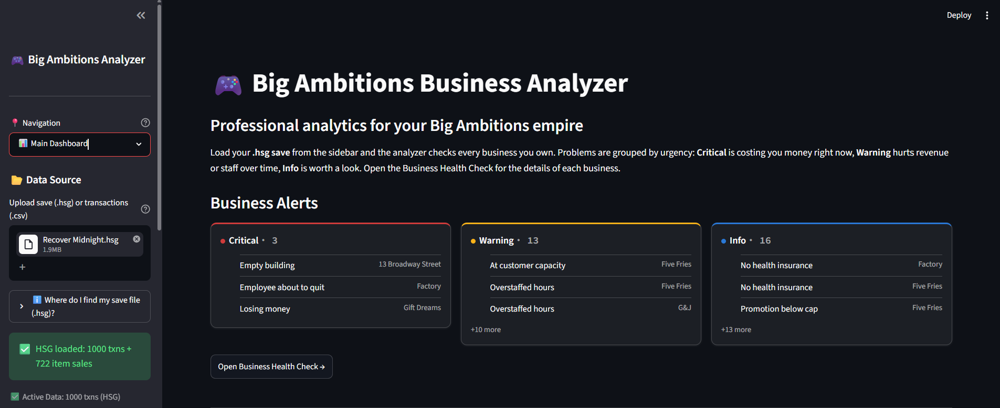
*Start here. Drag your Big Ambitions transaction export (CSV or XLSM) into the sidebar uploader — you upload once and every module reads from it. Make sure the game was set to English before exporting.*

**2. Dashboard overview**
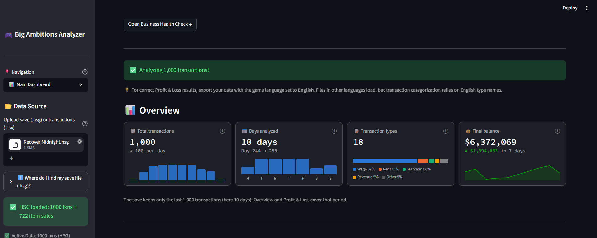
*A one-glance summary of revenue, costs and profit across your businesses, plus the weekly wage baseline the schedule optimizer compares against later.*

**3. Profit & Loss analysis**
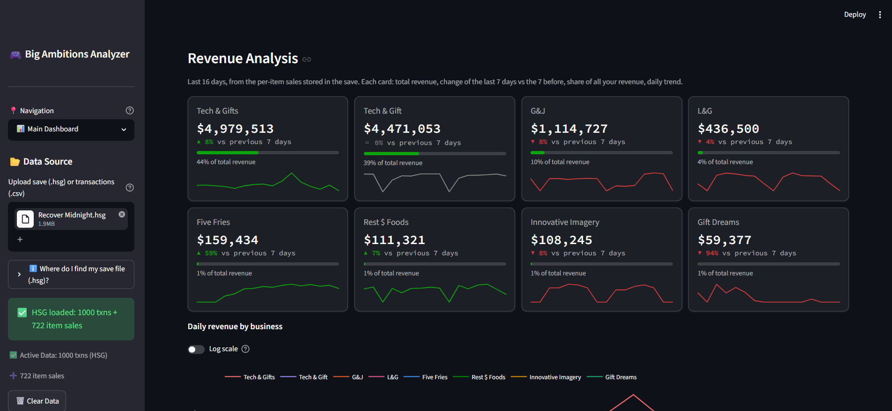
*Profit and loss broken down by product and category, with every transaction auto-categorized. Sort and filter to see what really drives — or drains — your margin, then export to CSV.*

### Schedule Optimizer — step by step

**4. Business setup**
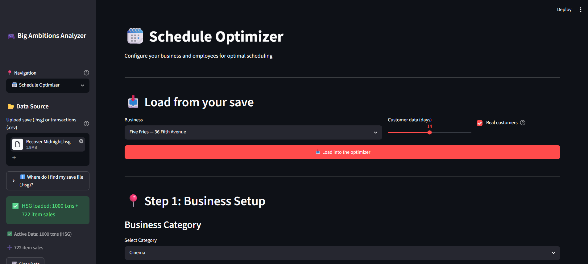
*Open the Schedule Optimizer and start by describing the business you want to staff.*

**5. Pick the business category**
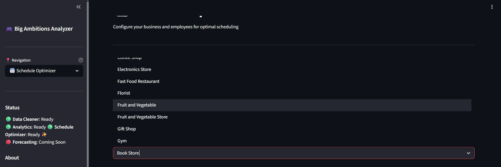
*Choose the category — this loads the matching building sizes, furniture and employee roles straight from the game data.*

**6. Choose the building size**
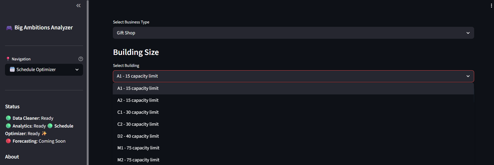
*Select your building size and version. It sets the customer capacity per hour, which drives how much staff each shift needs.*

**7. Select your furniture**
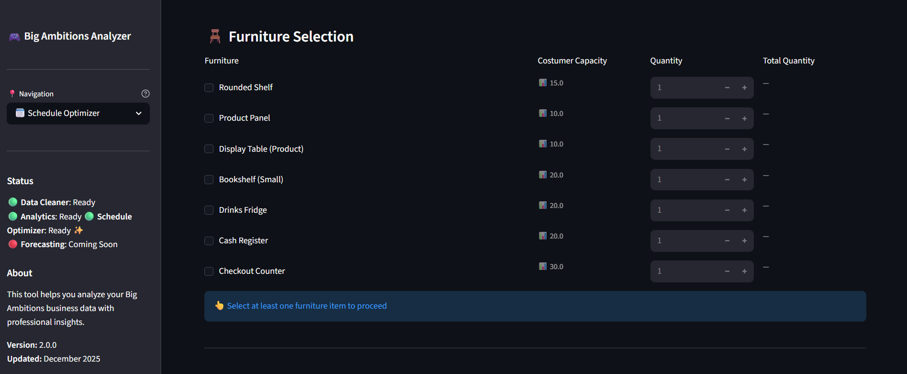
*Add the furniture you own. Workstations (cash registers, guard lockers, cleaning stations) decide how many people of each role can work at the same time.*

**8. Review customer capacity**
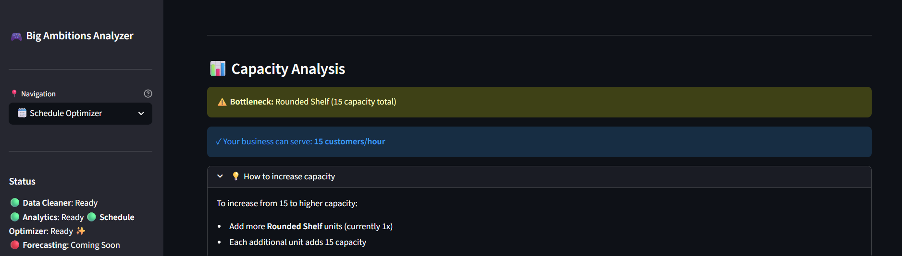
*Check the effective customer capacity your furniture supports — the optimizer combines this with the game's hourly demand curve to size every shift.*

**9. Add your employees**
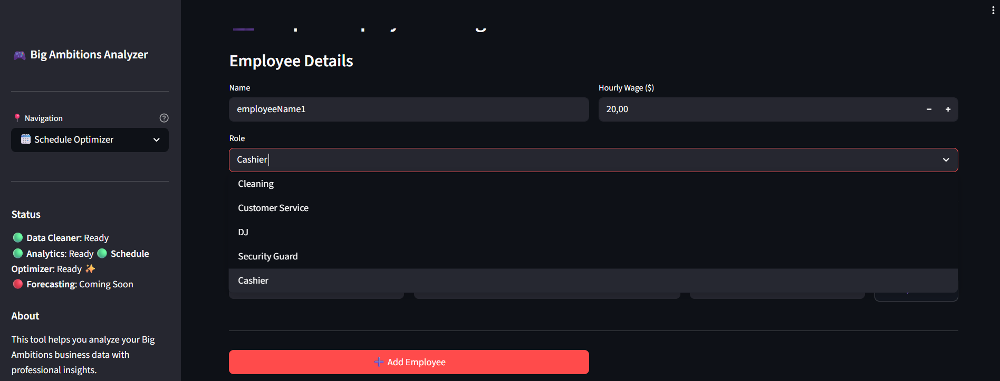
*Enter each employee with their role and hourly wage.*

**10. Set employee requests**
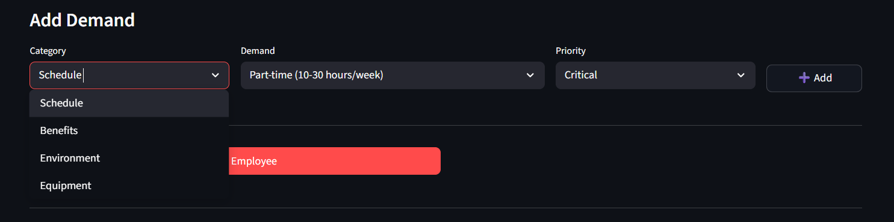
*Add each employee's requests (part/full-time, days off, no-weekend, shift preferences) and mark them Critical (always respected) or Important (respected when affordable).*

**11. Set operating hours**
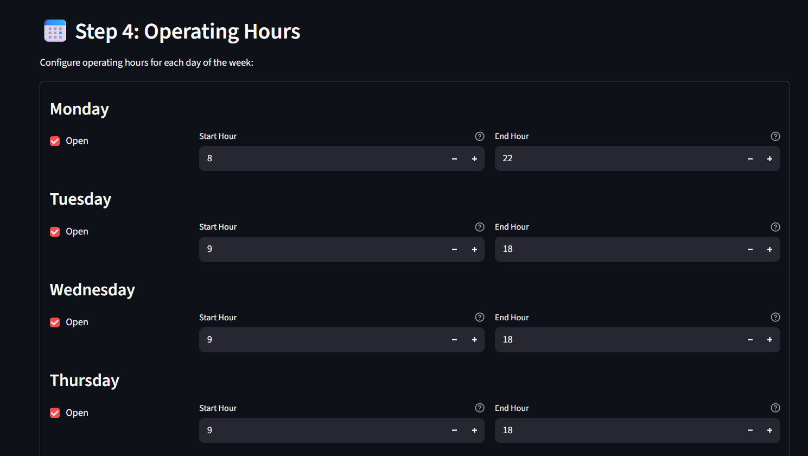
*Define your weekly opening hours per day. Closed days and overnight hours are handled automatically.*

**12. Run the optimization**
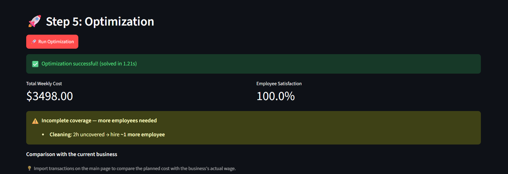
*Launch the solver: it minimizes weekly wage cost while honoring your constraints, and reports the total cost and an employee-satisfaction score.*

**13. Your optimized weekly schedule**
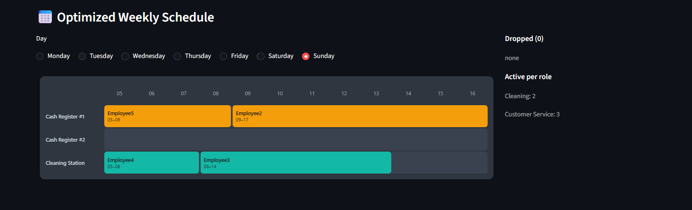
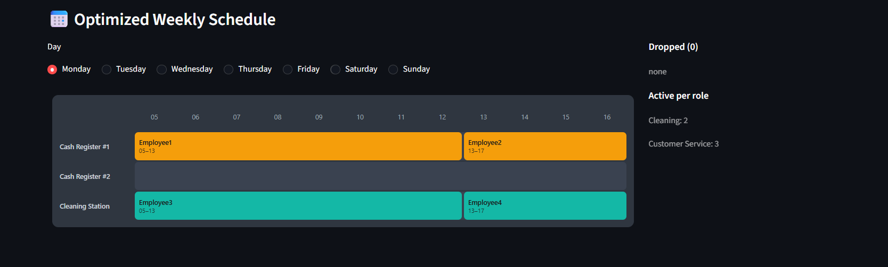
*The result as a game-style grid — who works which station and which hours, day by day.*

**14. Compare against your current staffing**
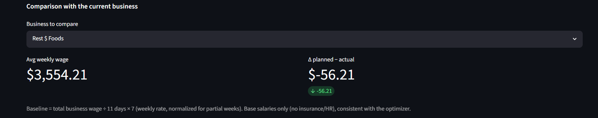
*See the planned wage cost next to your current in-game staffing (from the data you imported) to gauge the savings.*

**15. Recommendations**
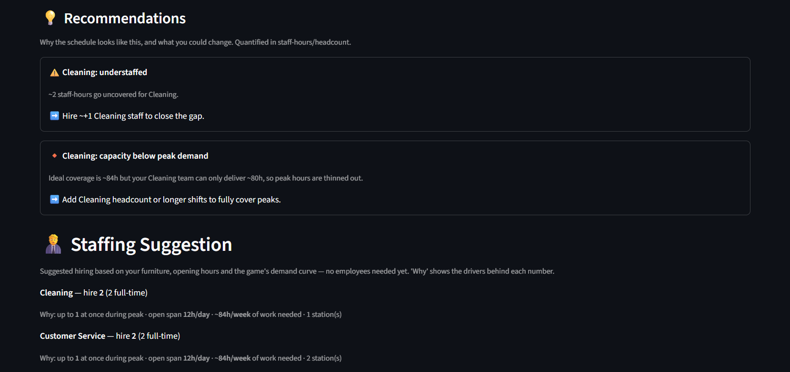
*Plain-language advice explains the schedule's trade-offs — unmet requests, understaffed roles, employees left unscheduled, and where hiring or trimming hours would help.*

### Business Health Check

**16. Health score**
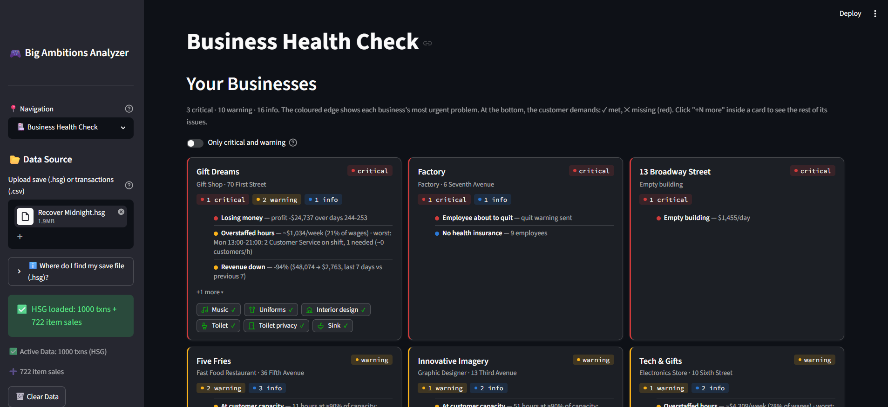
*A quick score of how well your setup matches the game's demand across staffing, hours and furniture.*

**17. Detailed breakdown**
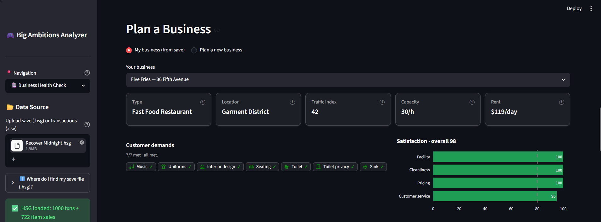
*The score explained area by area, with concrete fixes to apply in-game.*

**18. Demand heatmap**
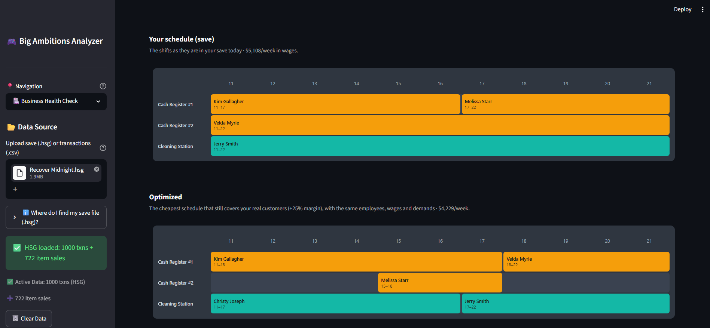
*When customers actually show up across the week — use it to line up your opening hours and staffing with real traffic.*

**19. Performance view**
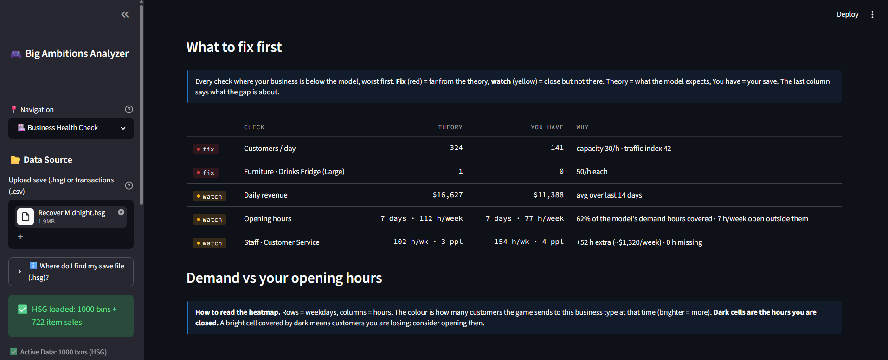
*Your results measured against the expected potential for that business.*

---

## 🛠️ Tech Stack

- **Python 3.11+** - Core language
- **Streamlit** - Web framework and UI
- **Pandas** - Data processing and analysis
- **Plotly** - Interactive visualizations
- **PuLP** - Linear programming for schedule optimization
- **Render.com** - Deployment platform

---

## 📊 How It Works

### Transaction Analysis
1. Parse CSV transaction data with malformed record handling
2. Categorize transactions using pattern matching
3. Aggregate data by product, category, and time period
4. Generate interactive visualizations

### Schedule Optimization
Uses **linear programming** to solve a constraint satisfaction problem:

- **Variables:** Employee shift assignments (binary: working or not)
- **Objective:** Maximize employee satisfaction score
- **Constraints:**
  - Business capacity (workstation limits)
  - Employee availability and preferences
  - Operating hours coverage
  - Part-time hour limits
  - Consecutive day work rules

The optimizer uses the PuLP library with CBC solver to generate optimal schedules in milliseconds.

---

## 🎯 Use Cases

- **Profit Analysis:** Identify which products/categories drive revenue
- **Trend Tracking:** Monitor business growth over time
- **Schedule Planning:** Automatically generate fair, efficient employee schedules
- **Data-Driven Decisions:** Base in-game business strategies on real data

---

## 🤝 Contributing

This is a personal portfolio project, but feedback and suggestions are welcome!

- Found a bug? [Open an issue](https://github.com/raytp29-hub/big-ambitions-analyzer1.0/issues)
- Have a feature idea? [Start a discussion](https://github.com/raytp29-hub/big-ambitions-analyzer1.0/issues/new)
- Want to contribute? [Submit a PR](https://github.com/raytp29-hub/big-ambitions-analyzer1.0/pulls)

---

## 📝 License

MIT License - feel free to use this for your own projects!

---


